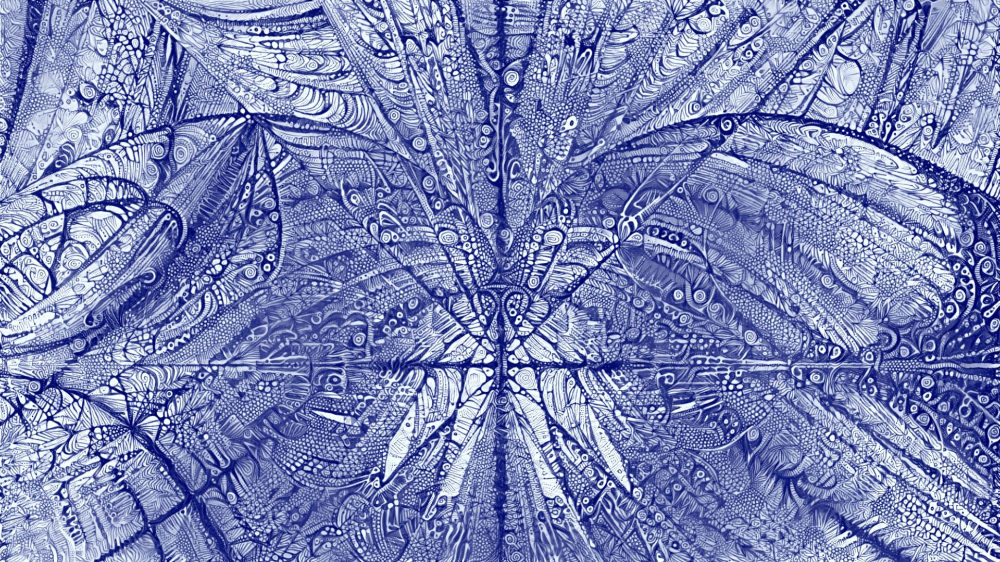

# ImgFix
A command line-based raster image editing tool by David K. McAllister

This program is useful for many basic image editing tasks. It also is a useful platform for implementing new or one-off algorithms.

The basic usage is:

    ImgFix -in input.jpg -dothing1 -dothing2 -out output.jpg

'-in' loads an image and makes it current. Most commands are modify the current image. '-out' saves an image as basically any type.

'-ld' and '-st' can be used to store an image in a "register" and to restore it as the current image. Some images are functions of two images, both the current image and an image from a numbered register.

Images are stored internally as 1, 2, 3, or 4 channels, with float, unsigned char, or other integer types. Most algorithms work on float or uc channels.

This code is implemented in C++. I originally developed it on Linux, but I've only run it on Windows lately. This code works great on Visual Studio 2019 with C++17. I hope it will build on Linux or Mac straightforwardly.

I'm happy to discuss these tools, to receive code contributions, bug fixes, or bug fix requests.

Building the Program
====================

Building ImgFix can be accomplished using CMake and a C++ compiler. It also depends on DMcTools: https://github.com/davemc0/DMcTools.git

DMcTools has my collection of graphics tools - matrix class, image stuff, 3D vector class, random numbers, timer, 3D model loader, etc.

How to build
------------

In the main directory, do something like:

    mkdir build
 cd build
 cmake .. -G "Visual Studio 16 2019" -A x64
 cd ..

Then you can build from the command line:

    cmake --build build/ --config Release

or launch build/ImgFix.sln in Visual Studio.
